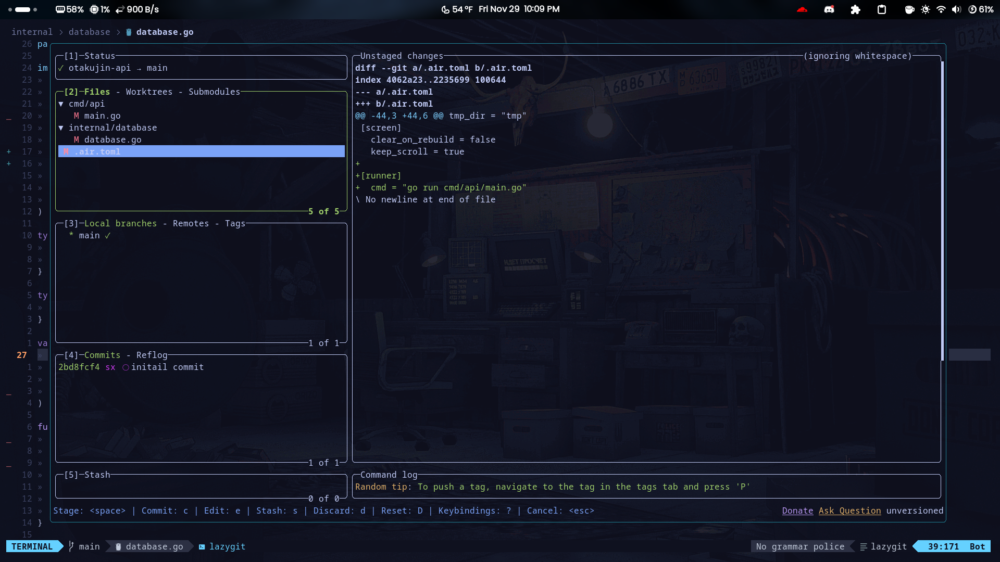
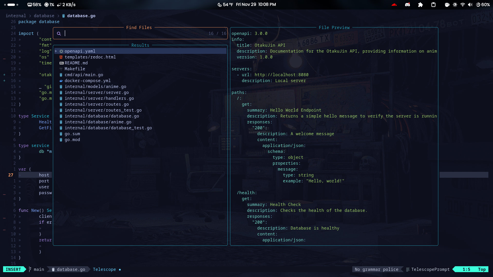
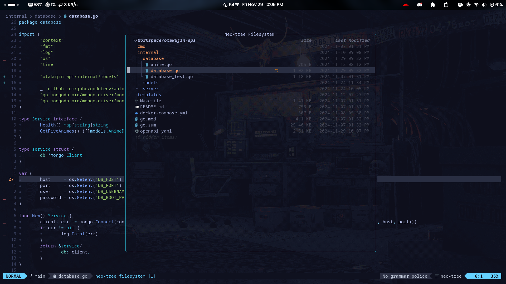
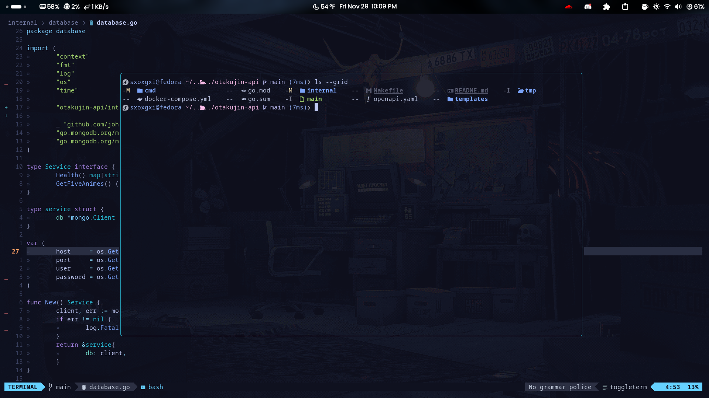

# Neovim Setup

This section showcases my Neovim setup, including configurations, themes, plugins, and customizations. Below are some screenshots of my Neovim environment.

## Neovim Screenshots

### 1. **Neovim Main Interface**


### 2. **Lazygit Floating Window**



### 3. **Telescope File Search**



### 4. **NeoTree File Explorer**



### 5. **Terminal Inside Neovim**



### Install Neovim

['stable'](https://github.com/neovim/neovim/releases/tag/stable) and latest
['nightly'](https://github.com/neovim/neovim/releases/tag/nightly) of Neovim.
If you are experiencing issues, please make sure you have the latest versions.

### Install External Dependencies

External Requirements:

- Basic utils: `git`, `make`, `unzip`, C Compiler (`gcc`)
- [ripgrep](https://github.com/BurntSushi/ripgrep#installation)
- Clipboard tool (xclip/xsel/win32yank or other depending on platform)
- A [Nerd Font](https://www.nerdfonts.com/): optional, provides various icons
  - if you have it set `vim.g.have_nerd_font` in `init.lua` to true
- Language Setup:
  - If you want to write Typescript, you need `npm`
  - If you want to write Golang, you will need `go`
  - etc.

> **NOTE**
> See [Install Recipes](#Install-Recipes) for additional Windows and Linux specific notes
> and quick install snippets

### Install

> **NOTE** > [Backup](#FAQ) your previous configuration (if any exists)

Neovim's configurations are located under the following paths, depending on your OS:

| OS                   | PATH                                      |
| :------------------- | :---------------------------------------- |
| Linux, MacOS         | `$XDG_CONFIG_HOME/nvim`, `~/.config/nvim` |
| Windows (cmd)        | `%localappdata%\nvim\`                    |
| Windows (powershell) | `$env:LOCALAPPDATA\nvim\`                 |

### Install Recipes

Below you can find OS specific install instructions for Neovim and dependencies.

#### Windows Installation

<details><summary>Windows with Microsoft C++ Build Tools and CMake</summary>
Installation may require installing build tools and updating the run command for `telescope-fzf-native`

See `telescope-fzf-native` documentation for [more details](https://github.com/nvim-telescope/telescope-fzf-native.nvim#installation)

This requires:

- Install CMake and the Microsoft C++ Build Tools on Windows

```lua
{'nvim-telescope/telescope-fzf-native.nvim', build = 'cmake -S. -Bbuild -DCMAKE_BUILD_TYPE=Release && cmake --build build --config Release && cmake --install build --prefix build' }
```

</details>
<details><summary>Windows with gcc/make using chocolatey</summary>
Alternatively, one can install gcc and make which don't require changing the config,
the easiest way is to use choco:

1. install [chocolatey](https://chocolatey.org/install)
   either follow the instructions on the page or use winget,
   run in cmd as **admin**:

```
winget install --accept-source-agreements chocolatey.chocolatey
```

2. install all requirements using choco, exit previous cmd and
   open a new one so that choco path is set, and run in cmd as **admin**:

```
choco install -y neovim git ripgrep wget fd unzip gzip mingw make
```

</details>
<details><summary>WSL (Windows Subsystem for Linux)</summary>

```
wsl --install
wsl
sudo add-apt-repository ppa:neovim-ppa/unstable -y
sudo apt update
sudo apt install make gcc ripgrep unzip git xclip neovim
```

</details>

#### Linux Install

<details><summary>Ubuntu Install Steps</summary>

```
sudo add-apt-repository ppa:neovim-ppa/unstable -y
sudo apt update
sudo apt install make gcc ripgrep unzip git xclip neovim
```

</details>
<details><summary>Debian Install Steps</summary>

```
sudo apt update
sudo apt install make gcc ripgrep unzip git xclip curl

# Now we install nvim
curl -LO https://github.com/neovim/neovim/releases/latest/download/nvim-linux64.tar.gz
sudo rm -rf /opt/nvim-linux64
sudo mkdir -p /opt/nvim-linux64
sudo chmod a+rX /opt/nvim-linux64
sudo tar -C /opt -xzf nvim-linux64.tar.gz

# make it available in /usr/local/bin, distro installs to /usr/bin
sudo ln -sf /opt/nvim-linux64/bin/nvim /usr/local/bin/
```

</details>
<details><summary>Fedora Install Steps</summary>

```
sudo dnf install -y gcc make git ripgrep fd-find unzip neovim
```

</details>

<details><summary>Arch Install Steps</summary>

```
sudo pacman -S --noconfirm --needed gcc make git ripgrep fd unzip neovim
```

</details>
